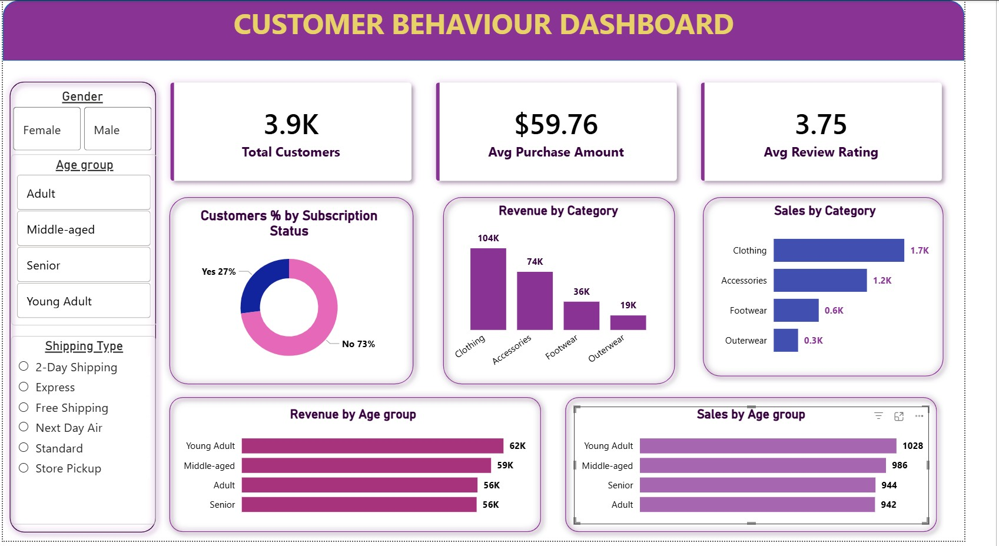

# customer-behaviour-analytics-end-to-end
End-to-end data analytics project analyzing customer shopping behavior using Python, SQL Server, and Power BI to uncover insights, improve customer engagement, and drive business decisions.
# 📊 Customer Behaviour Analytics Project

## 🔍 Overview  
This project focuses on analyzing customer shopping behavior to identify trends, improve customer engagement, and optimize business strategies. The analysis covers the complete data pipeline — from data cleaning and transformation to advanced SQL querying and interactive dashboard creation.

## :memo: **Business Problem:**  
How can customer shopping data be leveraged to identify trends, improve customer engagement, and optimize marketing and product strategies?

---

## 📁 Dataset  
- Total Records: **3,900 transactions**  
- Features: **18 columns**  

### Key Data Includes:
- Customer demographics (Age, Gender, Subscription Status)  
- Purchase details (Category, Amount, Season)  
- Behavioral metrics (Discounts, Reviews, Frequency)  

### Data Cleaning:
- Handled missing values in Review Rating  
- Standardized column names  
- Created derived columns for better analysis  

---

## 🛠️ Tools & Technologies  
- **Python (Pandas, NumPy)** → Data cleaning & EDA  
- **SQL Server** → Data modeling & analysis  
- **Power BI** → Dashboard & visualization  
- **Jupyter Notebook** → Development environment  
- **Gamma** → Presentation creation  

---

## ⚙️ Project Workflow  

### 1. Data Loading & Cleaning (Python)
- Loaded dataset using Pandas  
- Handled missing values using median imputation  
- Renamed columns to snake_case  
- Feature engineering:
  - Created `age_group`
  - Created purchase frequency metrics  
- Removed redundant columns  

---

### 2. Exploratory Data Analysis (EDA)
- Analyzed purchase distribution  
- Identified customer behavior trends  
- Category-wise sales insights  
- Subscription vs non-subscription analysis  

---

### 3. SQL Analysis (SQL Server)
Performed advanced queries such as:

- Revenue by gender  
- Customer segmentation (New, Returning, Loyal)  
- Top products by rating  
- Discount impact analysis  
- Shipping type vs purchase behavior  
- Revenue by age group  

---

### 4. Power BI Dashboard  

#### Key KPIs:
- Total Customers: **3.9K**  
- Avg Purchase Amount: **$59.76**  
- Avg Rating: **3.75**  

#### Dashboard Insights:
- Revenue by category  
- Sales by category  
- Customer segmentation  
- Age group performance  
- Subscription distribution  

## 📷 Dashboard Preview

---

### 5. Reporting & Presentation  
- Detailed report created with insights  
- Business recommendations provided  
- Presentation designed using Gamma  

---

## 📈 Key Insights  

- Male customers contribute ~68% of total revenue  
- Young adults generate the highest revenue  
- 80% of customers are loyal/repeat buyers  
- Express shipping users spend more per purchase  
- Discounts strongly influence buying behavior  

---

## 💡 Business Recommendations  

- Increase subscription adoption with exclusive benefits  
- Implement loyalty programs for repeat customers  
- Optimize discount strategies to maintain margins  
- Target high-value age groups in marketing campaigns  
- Promote top-rated and best-selling products  

---

## :woman_technologist: Author

**Mandarada Uma Maheshwari**

Data Analyst | SQL | Power BI | Python
